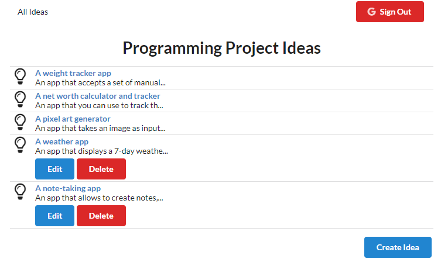

## Programming Project Ideas App 💻

The best way to learn to code is to start building projects. At some point, you’ve got to stop doing exercises and start making apps.
But what should you make? Here you can look at some project ideas or even add your own.

#### Install & Start

    $ git clone https://github.com/orvalho/app-ideas
    $ cd app-ideas
    $ cd api
    $ npm install
    $ npm start

    $ cd ../
    $ cd client
    $ npm install
    $ npm start

#### App

#### Stack

-   React
-   React DOM
-   Redux
-   React Redux
-   React Router DOM
-   History
-   Redux Form
-   Redux Thunk
-   Axios
-   JSON Server
-   Lodash
-   Google API client library (auth2)
-   Semantic UI
-   Redux DevTools extension
